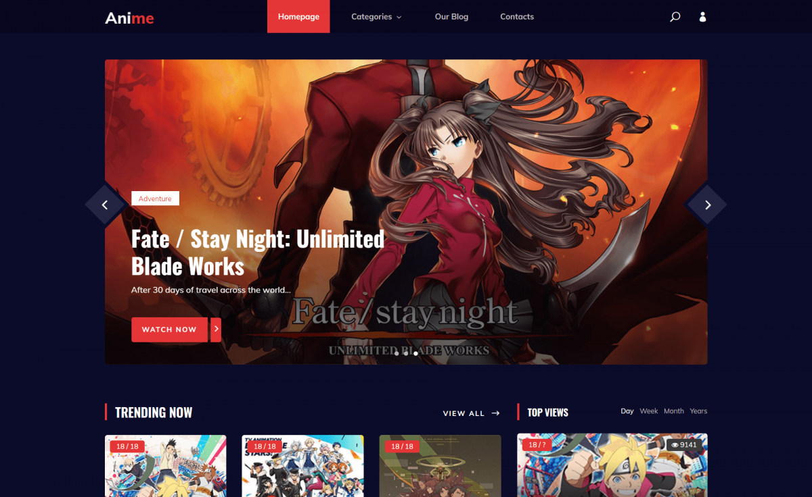
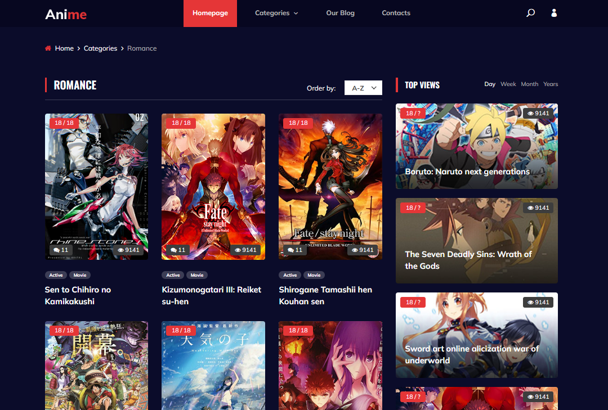
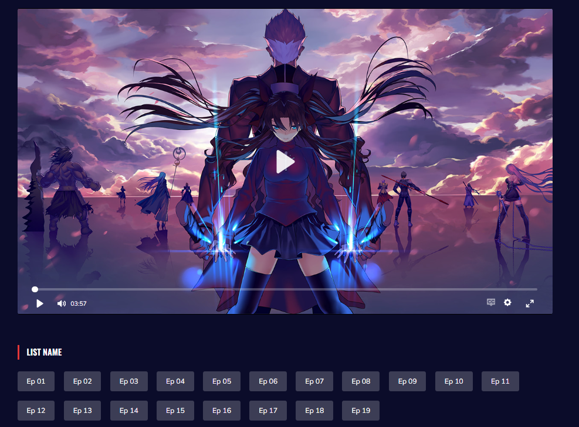

# AnimeApp – Сайт для просмотра аниме

AnimeApp – это веб-сайт, разработанный на Django, который позволяет пользователям, просматривать аниме. Сайт включает каталог аниме, рейтинги и комментарии.

## Структура проекта

### Основные директории и файлы:
- **animeApp/** - Основная директория проекта.
  - **animeWatch/** - Модуль для просмотра аниме.
  - **config/** - Конфигурационные файлы проекта.
  - **fixtures/** - Демонстрационные данные для загрузки в базу.
  - **home/** - Модуль для главной страницы.
  - **logs/** - Логи для отслеживания ошибок и событий.
  - **main/** - Основная логика приложения.
  - **media/** - Загружаемые файлы (например, обложки аниме).
  - **static/** - Статические файлы (CSS, JS, изображения).
  - **templates/** - HTML-шаблоны для отображения страниц.
  - **users/** - Управление пользователями (регистрация, авторизация, профили).
  - **utils/** - Вспомогательные функции и скрипты.
  - **manage.py** - Основной скрипт управления проектом.

- **images/** - Каталог с изображениями для сайта.
- **venv/** - Виртуальное окружение.
- **.env** - Конфигурационный файл для переменных окружения.
- **.gitignore** - Исключения для Git.
- **README.md** - Этот файл с документацией.
- **requirements.txt** - Список зависимостей проекта.

### Основной функционал:
1. **Каталог аниме:**
   - Поиск и фильтрация по жанру, году выпуска, рейтингу.
   - Просмотр описания и деталей аниме.
2. **Профили пользователей:**
   - Регистрация и авторизация.
3. **Комментарии и обсуждения:**
   - Комментирование серий и обсуждение аниме.
4. **Рейтинги: не доконца**
   - Возможность ставить оценки аниме.
5. **Медиатека:**
   - Загрузка обложек и материалов к аниме.
6. **Интерактивная главная страница:**
   - Список популярных аниме.
   - Рекомендуемые пользователю на основе предпочтений.


### Изображение сайта

1. 
2. 
3. 
4. 
## Установка

### Требования:
1. Python версии 3.8 или выше.
2. Django версии 3.x или выше.
3. PostgreSQL для хранения данных.

### Установка базы данных Postgresql

1. Создайте файл .env
2. Укажите DB_NAME, DB_USER... тд

### Установка зависимостей

1. Клонируйте репозиторий:

```bash
git clone https://github.com/Lokrip/django-online-shop.git

pip instal -r requirements.txt

cd adminB

python manage.py makemigrations
python manage.py migrate
python manage.py runserver

